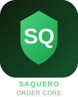
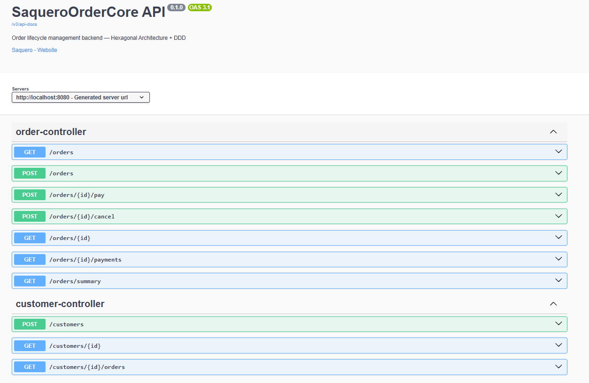
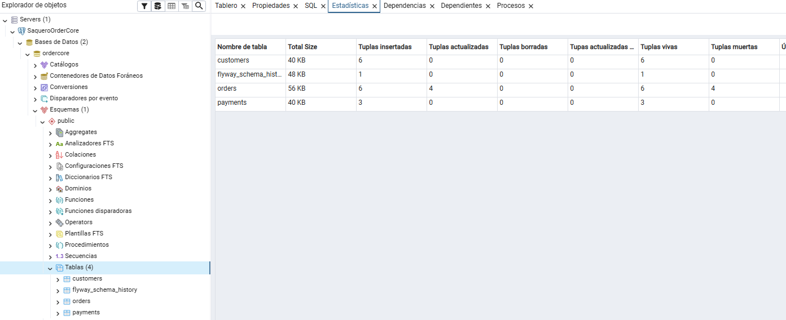
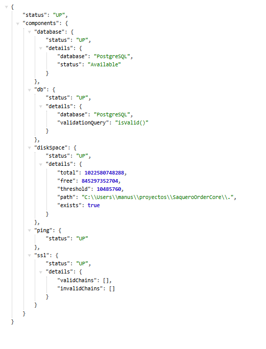
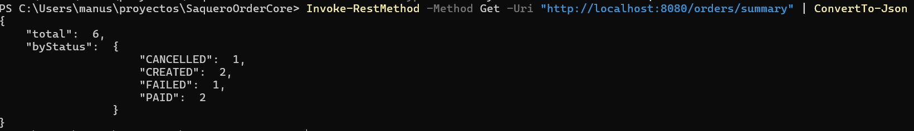

<p align="center">
  
</p>

<h1 align="center">SaqueroOrderCore</h1>
<p align="center">
  Backend for order lifecycle management -- Java 21 · Spring Boot 3 · Hexagonal Architecture · DDD
</p>

<p align="center">
  
  
  
  
  
</p>

---

## What is this?

SaqueroOrderCore is a production-style backend that manages the full lifecycle of orders:
creating orders, processing payments, cancelling orders and tracking payment history.

Built as a portfolio project to demonstrate real backend engineering practices:
clean architecture, domain-driven design, testable code and professional API design.

---

## Preview

### Swagger UI -- All endpoints documented



### pgAdmin -- Database tables with real data



### Health Check -- PostgreSQL status via Actuator



### Orders Summary -- Real-time order count by status



---

## Tech Stack

| Technology     | Version | Role                 |
| -------------- | ------- | -------------------- |
| Java           | 21      | Language             |
| Spring Boot    | 3.4.5   | Framework            |
| PostgreSQL     | 16      | Database             |
| Flyway         | 10.x    | Schema migrations    |
| Docker Compose | v2      | Local infrastructure |
| JUnit 5        | 5.11.x  | Testing              |
| Mockito        | 5.x     | Mocking in tests     |
| Springdoc      | 2.8.x   | OpenAPI / Swagger UI |
| Maven          | wrapper | Build tool           |

---

## Architecture

Hexagonal Architecture + Clean Architecture + Tactical DDD.

```text
+-------------------------------------+
|          Infrastructure             |
|  (Controllers, JPA, Config)         |
|                                     |
|      +----------------------+       |
|      |     Application      |       |
|      |  (Use Cases, Ports)  |       |
|      |                      |       |
|      |   +--------------+   |       |
|      |   |    Domain    |   |       |
|      |   |  (pure Java) |   |       |
|      |   +--------------+   |       |
|      +----------------------+       |
+-------------------------------------+
```

- **Domain** -- pure Java, no framework dependencies, owns all business rules
- **Application** -- use cases, ports (interfaces), commands, DTOs
- **Infrastructure** -- JPA entities, Spring Data, REST controllers, mappers

See [ARCHITECTURE.md](ARCHITECTURE.md) for detailed design decisions.

---

## Order State Machine

```text
CREATED -> PROCESSING -> PAID
CREATED -> PROCESSING -> FAILED
CREATED -> CANCELLED
```

State transitions are enforced by the domain model.
Any invalid transition throws `InvalidOrderStateTransitionException`.

---

## Getting Started (Windows)

### Requirements

- Java 21 (`java -version`)
- Docker Desktop running
- PowerShell

### 1. Clone the repo

```powershell
git clone https://github.com/Saquero/SaqueroOrderCore.git
cd SaqueroOrderCore
```

### 2. Start infrastructure

```powershell
docker compose up -d
```

### 3. Run the application

```powershell
# Standard mode
.\mvnw.cmd spring-boot:run

# Dev mode (loads seed data automatically)
.\mvnw.cmd spring-boot:run "-Dspring-boot.run.profiles=dev"
```

App available at: `http://localhost:8080`

### 4. Open Swagger UI

```
http://localhost:8080/swagger-ui/index.html
```

### 5. Open pgAdmin (visual DB)

```
http://localhost:5050
```

Login: `admin@saquero.com` / `admin`

Connect to server:

- Host: `postgres`
- Port: `5432`
- Database: `ordercore`
- Username: `ordercore_user`
- Password: `ordercore_pass`

### Stop everything

```powershell
docker compose down
```

---

## API Endpoints

| Method | Path                   | Description                   |
| ------ | ---------------------- | ----------------------------- |
| POST   | /customers             | Create customer               |
| GET    | /customers/{id}        | Get customer by ID            |
| GET    | /customers/{id}/orders | Get all orders for a customer |
| POST   | /orders                | Create order                  |
| GET    | /orders                | List orders (with pagination) |
| GET    | /orders?status=CREATED | Filter orders by status       |
| GET    | /orders/summary        | Order count by status         |
| GET    | /orders/{id}           | Get order by ID               |
| POST   | /orders/{id}/pay       | Process payment               |
| POST   | /orders/{id}/cancel    | Cancel order                  |
| GET    | /orders/{id}/payments  | Payment history for order     |
| GET    | /actuator/health       | Health check with DB status   |

---

## Example Requests

### Create a customer

```powershell
Invoke-RestMethod -Method Post -Uri "http://localhost:8080/customers" `
  -ContentType "application/json" `
  -Body '{"name": "John Doe", "email": "john@example.com"}' | ConvertTo-Json
```

### Create an order

```powershell
Invoke-RestMethod -Method Post -Uri "http://localhost:8080/orders" `
  -ContentType "application/json" `
  -Body '{"customerId": "YOUR-CUSTOMER-UUID", "totalAmount": 99.99, "currency": "EUR"}' | ConvertTo-Json
```

### Process payment

```powershell
Invoke-RestMethod -Method Post -Uri "http://localhost:8080/orders/YOUR-ORDER-UUID/pay" | ConvertTo-Json
```

### Cancel order

```powershell
Invoke-RestMethod -Method Post -Uri "http://localhost:8080/orders/YOUR-ORDER-UUID/cancel" | ConvertTo-Json
```

### Order summary

```powershell
Invoke-RestMethod -Method Get -Uri "http://localhost:8080/orders/summary" | ConvertTo-Json
```

---

## Running Tests

```powershell
.\mvnw.cmd test
```

Current test suite: **19 tests, 0 failures**

- `OrderTest` -- 7 tests, all state transitions including invalid ones
- `MoneyTest` -- 8 tests, value object invariants and edge cases
- `ProcessPaymentUseCaseTest` -- 3 tests with mocked ports

---

## Prepared for Kafka

The `infrastructure/adapter/out/events` package is ready for domain event publishing.

When a message broker is integrated, events like `OrderPaidEvent`, `OrderFailedEvent`
and `OrderCancelledEvent` will be published after state transitions -- following
either direct publish or the Outbox pattern.

No domain changes required to add this.

---

## Project Structure

```text
src/main/java/com/saquero/ordercore
+-- domain
|   +-- model          Order, Customer, Payment, OrderStatus, PaymentStatus
|   +-- valueobject    Money
|   +-- exception      OrderDomainException, InvalidOrderStateTransitionException
+-- application
|   +-- port/in        Use case interfaces
|   +-- port/out       Repository port interfaces
|   +-- command        CreateOrderCommand, ProcessPaymentCommand...
|   +-- dto            OrderResponse, PaymentResponse, PageResponse...
|   +-- usecase        Use case implementations
+-- infrastructure
    +-- adapter/in/web          REST controllers, request DTOs
    +-- adapter/out/persistence JPA entities, repositories, mappers
    +-- adapter/out/events      Prepared for Kafka
    +-- config                  OpenAPI, CorrelationId filter, Dev initializer
    +-- exception               GlobalExceptionHandler, ApiError
```

---

## Part of the Saquero Backend Ecosystem

| Project                                                     | Stack                   | Description                                            |
| ----------------------------------------------------------- | ----------------------- | ------------------------------------------------------ |
| [SaqueroCloud](https://github.com/Saquero/SaqueroCloud)     | .NET 8 + React          | SaaS admin platform, JWT auth, subscription management |
| SaqueroOrderCore                                            | Java 21 + Spring Boot 3 | Order lifecycle backend, DDD, Hexagonal                |
| [SaqueroJobs](https://github.com/Saquero/SaqueroJobs)       | .NET 8                  | Background job processing engine                       |
| [SaqueroGateway](https://github.com/Saquero/SaqueroGateway) | .NET 8                  | API Gateway -- single entry point                      |

---

## Ecosystem Health

| Service          | Port | Health           |
| ---------------- | ---- | ---------------- |
| SaqueroGateway   | 5100 | /health          |
| SaqueroCloud     | 5000 | /health          |
| SaqueroOrderCore | 8080 | /actuator/health |
| SaqueroJobs      | 5200 | /health          |

---

## Future Improvements

- Cron expression evaluation
- Docker Compose for full ecosystem
- CI/CD pipeline

---

<p align="center">
  <a href="https://linkedin.com/in/manusaquero">
    
  </a>
  <a href="mailto:manusaquero@gmail.com">
    
  </a>
  <a href="https://github.com/Saquero">
    
  </a>
</p>
